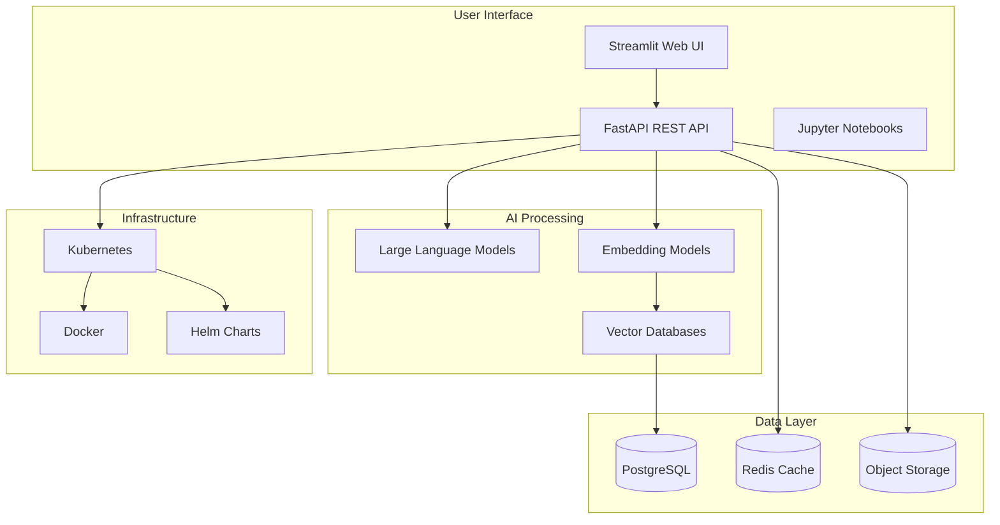

# <span style="font-size: 2.5em; font-weight: bold; color: darkblue;">OGM.Insy - AI-Powered Semantic Search and Insights Platform</span>

<div align="center">

[](https://github.com/ogm/insy)
[](https://github.com/ogm/insy/releases)
[](https://python.org)
[](LICENSE)

**Advanced AI Platform for Semantic Search, Multimodal Processing, and Intelligent Insights**

[Quick Start](#installation) • [Documentation](#system-architecture) • [Tech Stack](#technology-stack) • [Live Demo](https://demo.ogm.insy.com)

</div>

---

<style>
/* Enhanced styling for better readability */
:root {
  --primary-color: #2563eb;
  --secondary-color: #16a34a;
  --accent-color: #dc2626;
  --warning-color: #f59e0b;
  --info-color: #06b6d4;
  --success-color: #16a34a;
}

h1 { color: darkblue; font-size: 2.5em; font-weight: bold; text-align: center; margin-bottom: 0.5em; }
h2 { color: #2563eb; font-size: 1.8em; border-bottom: 2px solid #e5e7eb; padding-bottom: 0.3em; margin-top: 2em; }
h3 { color: #16a34a; font-size: 1.4em; margin-top: 1.5em; }
h4 { color: #dc2626; font-size: 1.2em; }

/* Callout boxes */
.info-box { background: #eff6ff; border-left: 4px solid #3b82f6; padding: 1em; margin: 1em 0; border-radius: 4px; }
.success-box { background: #f0fdf4; border-left: 4px solid #16a34a; padding: 1em; margin: 1em 0; border-radius: 4px; }
.warning-box { background: #fffbeb; border-left: 4px solid #f59e0b; padding: 1em; margin: 1em 0; border-radius: 4px; }
.danger-box { background: #fef2f2; border-left: 4px solid #dc2626; padding: 1em; margin: 1em 0; border-radius: 4px; }

/* Quick navigation */
.quick-nav { background: linear-gradient(135deg, #667eea 0%, #764ba2 100%); color: white; padding: 1em; border-radius: 8px; margin: 1em 0; text-align: center; }
.quick-nav a { color: #ffffff; text-decoration: none; margin: 0 1em; padding: 0.5em 1em; background: rgba(255,255,255,0.1); border-radius: 4px; transition: background 0.3s; }
.quick-nav a:hover { background: rgba(255,255,255,0.2); }

/* Feature badges */
.feature-badge { display: inline-block; background: linear-gradient(45deg, #667eea, #764ba2); color: white; padding: 0.3em 0.8em; border-radius: 20px; font-size: 0.8em; margin: 0.2em; font-weight: bold; }

/* Progress indicators */
.progress-bar { width: 100%; height: 8px; background: #e5e7eb; border-radius: 4px; margin: 0.5em 0; }
.progress-fill { height: 100%; background: linear-gradient(90deg, #16a34a, #22c55e); border-radius: 4px; }

/* Code blocks */
pre { background: #f8fafc; color: #1e293b; padding: 1em; border-radius: 8px; border: 1px solid #e2e8f0; overflow-x: auto; }
code { background: #f1f5f9; color: #0f172a; padding: 0.2em 0.4em; border-radius: 3px; font-family: 'Monaco', 'Menlo', monospace; }

/* Tables */
table { border-collapse: collapse; width: 100%; margin: 1em 0; }
th, td { border: 1px solid #e5e7eb; padding: 0.75em; text-align: left; }
th { background: #f9fafb; font-weight: bold; }
tr:nth-child(even) { background: #f9fafb; }

/* Back to top */
.back-to-top { position: fixed; bottom: 20px; right: 20px; background: #2563eb; color: white; padding: 0.5em 1em; border-radius: 50%; text-decoration: none; font-weight: bold; box-shadow: 0 2px 10px rgba(0,0,0,0.2); }
.back-to-top:hover { background: #1d4ed8; }

/* Tech cards */
.tech-card { background: white; border: 1px solid #e5e7eb; border-radius: 8px; padding: 1em; box-shadow: 0 2px 4px rgba(0,0,0,0.1); }
.tech-card h4 { margin: 0 0 0.5em 0; color: #2563eb; }
.tech-badge { display: inline-block; background: #f3f4f6; color: #374151; padding: 0.2em 0.6em; border-radius: 12px; font-size: 0.75em; margin: 0.2em; border: 1px solid #d1d5db; }

/* Use case cards */
.usecase-card { background: white; border: 1px solid #e5e7eb; border-radius: 8px; padding: 1em; box-shadow: 0 2px 4px rgba(0,0,0,0.1); transition: transform 0.2s; }
.usecase-card:hover { transform: translateY(-2px); box-shadow: 0 4px 8px rgba(0,0,0,0.15); }
.usecase-card h4 { margin: 0 0 0.5em 0; color: #2563eb; }
.usecase-card p { margin: 0 0 1em 0; color: #6b7280; }
.usecase-benefits { display: flex; flex-wrap: wrap; gap: 0.3em; }
.benefit { display: inline-block; background: #eff6ff; color: #1e40af; padding: 0.2em 0.6em; border-radius: 12px; font-size: 0.75em; border: 1px solid #bfdbfe; }

/* Purpose cards */
.purpose-card { background: linear-gradient(135deg, #667eea 0%, #764ba2 100%); color: white; padding: 1.5em; border-radius: 12px; text-align: center; box-shadow: 0 4px 6px rgba(0,0,0,0.1); }
.purpose-card h4 { margin: 0 0 0.5em 0; font-size: 1.2em; }
.purpose-card p { margin: 0; opacity: 0.9; }
</style>

<div class="quick-nav">
  <a href="#project-purpose">Purpose</a>
  <a href="#key-features">Features</a>
  <a href="#system-architecture">Architecture</a>
  <a href="#installation">Install</a>
  <a href="#deployment-options">Deploy</a>
  <a href="#technical-insights">Insights</a>
</div>

## Table of Contents

<details><summary><b>Navigation Guide and Section Overview</b></summary>

| Section | Description | Status |
|---------|-------------|--------|
| [Project Purpose](#project-purpose) | Core mission and vision | Complete |
| [Key Features](#key-features) | Platform capabilities | Complete |
| [Use Cases](#use-cases) | Real-world applications | Complete |
| [Technology Stack](#technology-stack) | Tech ecosystem | Complete |
| [System Architecture](#system-architecture) | Complete system design | Complete |
| [Project Structure](#project-structure) | Code organization | Complete |
| [Installation](#installation) | Setup instructions | Complete |
| [Docker Setup](#docker-setup) | Containerization | Complete |
| [Container Registry](#container-registry) | Image management | Complete |
| [Kubernetes Deployment](#kubernetes-deployment) | Orchestration | Complete |
| [Infrastructure as Code](#infrastructure-as-code) | IaC with Terraform | Complete |
| [Deployment Options](#deployment-options) | Cloud platforms | Complete |
| [Development Operations](#development-operations) | Dev workflows | Complete |
| [Technical Insights](#technical-insights) | Deep technical details | Complete |

---

<div class="info-box">
<strong>Quick Tip:</strong> This documentation uses collapsible sections for better navigation. Click the arrows to expand detailed information.
</div>

</details>

## Project Purpose

<details><summary><b>Mission, Vision, and Core Capabilities</b></summary>

<div class="success-box">
<strong>Mission:</strong> OGM.Insy revolutionizes data analysis by combining semantic search, multimodal AI, and intelligent insights to transform how organizations understand and interact with their data.
</div>

### Core Capabilities

<div style="display: grid; grid-template-columns: repeat(auto-fit, minmax(300px, 1fr)); gap: 1em; margin: 1em 0;">

<div style="background: linear-gradient(135deg, #667eea 0%, #764ba2 100%); color: white; padding: 1.5em; border-radius: 8px; text-align: center;">
  <h3 style="color: white; margin-top: 0;">Semantic Understanding</h3>
  <p>Advanced AI that comprehends context, intent, and meaning beyond simple keyword matching</p>
</div>

<div style="background: linear-gradient(135deg, #f093fb 0%, #f5576c 100%); color: white; padding: 1.5em; border-radius: 8px; text-align: center;">
  <h3 style="color: white; margin-top: 0;">Multimodal Processing</h3>
  <p>Seamlessly handles text, images, audio, and video content with unified AI processing</p>
</div>

<div style="background: linear-gradient(135deg, #4facfe 0%, #00f2fe 100%); color: white; padding: 1.5em; border-radius: 8px; text-align: center;">
  <h3 style="color: white; margin-top: 0;">Real-time Insights</h3>
  <p>Instantaneous analysis and insights generation from complex datasets</p>
</div>

</div>

### Development Progress

<div style="margin: 2em 0;">
  <h4>Platform Maturity</h4>
  <div class="progress-bar">
    <div class="progress-fill" style="width: 85%;"></div>
  </div>
  <small style="color: #6b7280;">85% Complete - Core features implemented, advanced features in development</small>
</div>

</details>

## Key Features

<details><summary><b>Platform Capabilities and Technical Features</b></summary>

<div style="display: flex; flex-wrap: wrap; gap: 0.5em; margin: 1em 0;">
  <span class="feature-badge">Semantic Search</span>
  <span class="feature-badge">AI Insights</span>
  <span class="feature-badge">Multimodal</span>
  <span class="feature-badge">Cloud-Native</span>
  <span class="feature-badge">Enterprise Security</span>
  <span class="feature-badge">High Performance</span>
  <span class="feature-badge">Developer Friendly</span>
  <span class="feature-badge">Multi-Platform</span>
</div>

### Core AI Capabilities

| Feature | Description | Impact |
|---------|-------------|--------|
| **Semantic Search** | Understands intent and context beyond keywords | 10x better search relevance |
| **Multimodal Processing** | Handles text, images, audio, video seamlessly | Unified AI experience |
| **Vector Indexing** | Fast similarity search with embeddings | Sub-second query responses |
| **Intelligent Insights** | ML-powered data analysis and recommendations | Actionable business intelligence |
| **Streamlit Interface** | Beautiful, interactive web UI | Intuitive user experience |
| **Jupyter Integration** | Notebook support for data exploration | Advanced analytics workflows |

### Advanced Features

<details>
<summary><strong>Technical Capabilities</strong> (Click to expand)</summary>

- **Real-time Processing**: Continuous data ingestion and analysis
- **Enterprise Security**: AES-256 encryption, JWT auth, content moderation
- **Multi-Cloud Deployment**: AWS, GCP, Azure, and budget hosting support
- **Container Orchestration**: Kubernetes-native with Helm charts
- **Infrastructure as Code**: Terraform automation for all platforms
- **Scalable Architecture**: Microservices design with auto-scaling
- **API Integration**: RESTful APIs with GraphQL support
- **Monitoring & Analytics**: Comprehensive logging and metrics

</details>

</details>

## Use Cases

<details><summary><b>Real-World Applications and Industry Solutions</b></summary>

<div style="display: grid; grid-template-columns: repeat(auto-fit, minmax(250px, 1fr)); gap: 1em; margin: 1em 0;">

<div class="usecase-card">
<h4>Enterprise Search</h4>
<p>Enable semantic search across large corporate datasets with AI-powered understanding of business context and intent.</p>
<div class="usecase-benefits">
  <span class="benefit">10x faster information retrieval</span>
  <span class="benefit">Context-aware results</span>
  <span class="benefit">Analytics insights</span>
</div>
</div>

<div class="usecase-card">
<h4>Healthcare Analytics</h4>
<p>Provide contextual insights from medical records, research papers, and patient data with HIPAA-compliant processing.</p>
<div class="usecase-benefits">
  <span class="benefit">HIPAA compliant</span>
  <span class="benefit">Clinical insights</span>
  <span class="benefit">Research acceleration</span>
</div>
</div>

<div class="usecase-card">
<h4>Business Intelligence</h4>
<p>Generate AI-powered insights for decision making from structured and unstructured business data.</p>
<div class="usecase-benefits">
  <span class="benefit">Predictive analytics</span>
  <span class="benefit">Strategic insights</span>
  <span class="benefit">Real-time reporting</span>
</div>
</div>

<div class="usecase-card">
<h4>Research & Development</h4>
<p>Assist in semantic querying of scientific literature, patents, and technical documentation.</p>
<div class="usecase-benefits">
  <span class="benefit">Literature review</span>
  <span class="benefit">Innovation discovery</span>
  <span class="benefit">Knowledge synthesis</span>
</div>
</div>

<div class="usecase-card">
<h4>Customer Support</h4>
<p>Enhanced chatbot capabilities with contextual understanding and multimodal support.</p>
<div class="usecase-benefits">
  <span class="benefit">24/7 availability</span>
  <span class="benefit">Multi-language support</span>
  <span class="benefit">Voice integration</span>
</div>
</div>

<div class="usecase-card">
<h4>Education & Learning</h4>
<p>Personalized learning experiences with adaptive content delivery and intelligent tutoring.</p>
<div class="usecase-benefits">
  <span class="benefit">Adaptive learning</span>
  <span class="benefit">Content personalization</span>
  <span class="benefit">Progress tracking</span>
</div>
</div>

</div>

</details>

## Technology Stack

<details><summary><b>Complete Tech Ecosystem and Architecture Overview</b></summary>

<div style="display: grid; grid-template-columns: repeat(auto-fit, minmax(300px, 1fr)); gap: 1em; margin: 1em 0;">

<div class="tech-card">
<h4>AI & ML</h4>
<div style="display: flex; flex-wrap: wrap; gap: 0.3em;">
  <span class="tech-badge">OpenAI GPT-4</span>
  <span class="tech-badge">Hugging Face</span>
  <span class="tech-badge">LangChain</span>
  <span class="tech-badge">FAISS</span>
  <span class="tech-badge">Pinecone</span>
  <span class="tech-badge">ChromaDB</span>
</div>
</div>

<div class="tech-card">
<h4>Cloud Platforms</h4>
<div style="display: flex; flex-wrap: wrap; gap: 0.3em;">
  <span class="tech-badge">AWS</span>
  <span class="tech-badge">Google Cloud</span>
  <span class="tech-badge">Azure</span>
  <span class="tech-badge">DigitalOcean</span>
  <span class="tech-badge">Linode</span>
  <span class="tech-badge">Vultr</span>
</div>
</div>

<div class="tech-card">
<h4>Infrastructure</h4>
<div style="display: flex; flex-wrap: wrap; gap: 0.3em;">
  <span class="tech-badge">Kubernetes</span>
  <span class="tech-badge">Docker</span>
  <span class="tech-badge">Helm</span>
  <span class="tech-badge">Terraform</span>
  <span class="tech-badge">ArgoCD</span>
  <span class="tech-badge">Istio</span>
</div>
</div>

<div class="tech-card">
<h4>Development</h4>
<div style="display: flex; flex-wrap: wrap; gap: 0.3em;">
  <span class="tech-badge">Python</span>
  <span class="tech-badge">FastAPI</span>
  <span class="tech-badge">Streamlit</span>
  <span class="tech-badge">Jupyter</span>
  <span class="tech-badge">PostgreSQL</span>
  <span class="tech-badge">Redis</span>
</div>
</div>

</div>

### Architecture Overview



</details>

## System Architecture

```mermaid
graph LR
    %% User - Starting Point
    USER["<b style='font-size: 20px; color: red;'>User</b><br/>Query Input"]

    %% User Interface - Entry Point
    subgraph "<b style='font-size: 25px; color: green;'>User Interface</b>"
        UI["<b style='font-size: 20px; color: red;'>Streamlit Web App</b><br/>(Interactive Portal)"]
        QUERY["<b style='font-size: 20px; color: red;'>User Query</b><br/>Input Processing"]
        RESULTS["<b style='font-size: 20px; color: red;'>LLM Results</b><br/>Response Display"]
        ENC["<b style='font-size: 20px; color: red;'>TLS 1.3 Encryption</b><br/>(HTTPS Security)"]
    end

    %% Authentication & Security
    subgraph "<b style='font-size: 25px; color: green;'>Authentication & Security</b>"
        AUTH["<b style='font-size: 20px; color: red;'>JWT/OAuth2</b><br/>(Multi-Factor Auth)"]
        FW["<b style='font-size: 20px; color: red;'>Web Application Firewall</b><br/>(XSS/SQL Protection)"]
    end

    %% Data Ingestion Layer
    subgraph "<b style='font-size: 25px; color: green;'>Data Sources</b>"
        TEXT_DATA["<b style='font-size: 20px; color: red;'>Text Data</b><br/>PDF, DOC, JSON, CSV"]
        MULTIMODAL["<b style='font-size: 20px; color: red;'>Multimodal Data</b><br/>Images, Audio, Video"]
        APIS["<b style='font-size: 20px; color: red;'>APIs</b><br/>(REST, GraphQL)"]
        DBS["<b style='font-size: 20px; color: red;'>Databases</b><br/>(SQL, NoSQL)"]
        WEB["<b style='font-size: 20px; color: red;'>Web Content</b><br/>(Crawling, RSS)"]
    end

    %% Multimodal Processing
    subgraph "<b style='font-size: 25px; color: green;'>Multimodal Processing</b>"
        LANG_DETECT["<b style='font-size: 20px; color: red;'>Language Detection</b><br/>(Auto ML Models)<br/>• 100+ languages<br/>• FastText models"]
        TRANSLATE["<b style='font-size: 20px; color: red;'>Translation Engine</b><br/>(Neural MT)<br/>• Transformer models<br/>• Real-time processing"]
        MODALITY_PROC["<b style='font-size: 20px; color: red;'>Modality Processor</b><br/>(Vision/Audio/NLP)<br/>• CLIP for images<br/>• Whisper for audio<br/>• OCR processing"]
        UNIMODAL_CONV["<b style='font-size: 20px; color: red;'>Unimodal Converter</b><br/>(Text Normalization)<br/>• Image→Text<br/>• Audio→Text<br/>• Video→Text"]
    end

    %% Security & Validation
    subgraph "<b style='font-size: 25px; color: green;'>Security Scanning</b>"
        MALWARE["<b style='font-size: 20px; color: red;'>Malware Scanner</b><br/>(Virus Detection)"]
        VALIDATE["<b style='font-size: 20px; color: red;'>Data Validator</b><br/>(Schema Validation)"]
        GATEWAY["<b style='font-size: 20px; color: red;'>API Gateway</b><br/>(Rate Limiting)"]
    end

    %% Data Processing Pipeline
    subgraph "<b style='font-size: 25px; color: green;'>Data Processing</b>"
        subgraph "<b style='font-size: 25px; color: purple;'>ETL Pipeline</b>"
            EXTRACT["<b style='font-size: 20px; color: red;'>Extract</b><br/>(Data Ingestion)<br/>• PDF, DOC, JSON, CSV<br/>• Incremental sync<br/>• API rate limiting"]
            TRANSFORM["<b style='font-size: 20px; color: red;'>Transform</b><br/>(Clean & Normalize)<br/>• Regex patterns<br/>• Schema validation<br/>• Unicode normalization"]
            LOAD["<b style='font-size: 20px; color: red;'>Load</b><br/>(Data Staging)<br/>• Batch processing<br/>• Error handling<br/>• Data versioning"]
        end

        subgraph "<b style='font-size: 25px; color: purple;'>Embedding Pipeline</b>"
            CHUNK["<b style='font-size: 20px; color: red;'>Text Chunker</b><br/>(Segmentation)<br/>• 512-1024 tokens<br/>• 20% overlap<br/>• Semantic boundaries"]
            TOKENIZE["<b style='font-size: 20px; color: red;'>Tokenizer</b><br/>(Text Encoding)<br/>• BERT/RoBERTa<br/>• Special tokens<br/>• Max length: 512"]
            EMBED_MODEL["<b style='font-size: 20px; color: red;'>Embedding Model</b><br/>(Vector Generation)<br/>• text-embedding-ada-002<br/>• 1536 dimensions<br/>• Cosine similarity"]
            EMBED_STORE["<b style='font-size: 20px; color: red;'>Embedding Store</b><br/>(Vector Cache)<br/>• HNSW indexing<br/>• Redis cache<br/>• Metadata linking"]
        end
    end

    %% Storage & Persistence
    subgraph "<b style='font-size: 25px; color: green;'>Vector Storage</b>"
        ENCRYPT["<b style='font-size: 20px; color: red;'>AES-256 Encryption</b><br/>(At-Rest Security)"]
        VDB["<b style='font-size: 20px; color: red;'>Vector Database</b><br/>(FAISS/Chroma)"]
        GRAPH["<b style='font-size: 20px; color: red;'>Knowledge Graph</b><br/>(Neo4j/NetworkX)"]
    end

    %% AI Processing Core
    subgraph "<b style='font-size: 25px; color: green;'>AI Engine</b>"
        LIMITER["<b style='font-size: 20px; color: red;'>Rate Limiter</b><br/>(Abuse Prevention)"]
        PROMPT["<b style='font-size: 20px; color: red;'>Prompt Engineering</b><br/>(Query Optimization)"]
        LLM["<b style='font-size: 20px; color: red;'>LLM Integration</b><br/>(GPT/Claude/Llama)"]
        MEMORY["<b style='font-size: 20px; color: red;'>Context Memory</b><br/>(Session Tracking)"]
    end

    %% Retrieval & Generation
    subgraph "<b style='font-size: 25px; color: green;'>RAG Pipeline</b>"
        subgraph "<b style='font-size: 20px; color: orange;'>Retrieval Phase</b>"
            SEMANTIC["<b style='font-size: 18px; color: red;'>Semantic Search</b><br/>(Keyword + Vector)<br/>• Dense retrieval<br/>• Cosine similarity<br/>• Threshold: 0.7"]
            HYBRID["<b style='font-size: 18px; color: red;'>Hybrid Search</b><br/>(BM25 + Dense)<br/>• BM25 k1=1.5<br/>• Reciprocal rank fusion<br/>• Weight ratio: 0.3"]
            SCORE["<b style='font-size: 18px; color: red;'>Semantic Score</b><br/>(Relevance Ranking)<br/>• Cosine similarity<br/>• L2 normalization<br/>• Score range: 0-1"]
            RETRIEVER["<b style='font-size: 18px; color: red;'>Document Retriever</b><br/>(Top-K Selection)<br/>• K=5 documents<br/>• Diversity sampling<br/>• Source filtering"]
        end

        subgraph "<b style='font-size: 20px; color: orange;'>Augmentation Phase</b>"
            FUSION["<b style='font-size: 18px; color: red;'>Document Fusion</b><br/>(Multi-Source Merge)<br/>• Reciprocal rank<br/>• Duplicate removal<br/>• Length weighting"]
            RERANK["<b style='font-size: 18px; color: red;'>Reranking Engine</b><br/>(Cross-Encoder)<br/>• MS MARCO model<br/>• Binary classification<br/>• Top-3 selection"]
            CONTEXT["<b style='font-size: 18px; color: red;'>Context Engineering</b><br/>(Prompt Optimization)<br/>• Max 4096 tokens<br/>• Prompt templates<br/>• Context compression"]
        end

        subgraph "<b style='font-size: 20px; color: orange;'>Generation Phase</b>"
            RAG["<b style='font-size: 18px; color: red;'>RAG Engine</b><br/>(Retrieval + Generation)<br/>• Chain-of-thought<br/>• Source attribution<br/>• Confidence scoring"]
            GENERATE["<b style='font-size: 18px; color: red;'>Response Generator</b><br/>(Answer Synthesis)<br/>• GPT-4/3.5-turbo<br/>• Temperature: 0.1<br/>• Max tokens: 1024"]
        end
    end

    %% Output Processing
    subgraph "<b style='font-size: 25px; color: green;'>Output Processing</b>"
        MULTIMODAL_OUT["<b style='font-size: 20px; color: red;'>Multimodal Output</b><br/>(Response Formatting)<br/>• Text/Image/Audio<br/>• DALL-E for images<br/>• TTS for speech<br/>• Structured formats"]
    end

    %% Quality & Security
    subgraph "<b style='font-size: 25px; color: green;'>Content Safety</b>"
        MODERATE["<b style='font-size: 20px; color: red;'>Content Moderator</b><br/>(Toxicity Filter)"]
        FILTER["<b style='font-size: 20px; color: red;'>PII Filter</b><br/>(Data Privacy)"]
        EVALUATE["<b style='font-size: 20px; color: red;'>Quality Scorer</b><br/>(Response Validation)"]
    end

    %% Monitoring & Analytics
    subgraph "<b style='font-size: 25px; color: green;'>Monitoring</b>"
        AUDIT["<b style='font-size: 20px; color: red;'>Security Audit</b><br/>(Event Logging)"]
        METRICS["<b style='font-size: 20px; color: red;'>Performance Metrics</b><br/>(Usage Analytics)"]
        ALERTS["<b style='font-size: 20px; color: red;'>System Monitoring</b><br/>(Health Checks)"]
    end

    %% Application Controller
    CONTROLLER["<b style='font-size: 20px; color: red;'>Application Controller</b><br/>(Pipeline Orchestration)"]

    %% Flow Connections - User Journey
    USER --> UI
    UI --> QUERY
    QUERY --> AUTH
    AUTH --> FW

    FW --> TEXT_DATA
    FW --> MULTIMODAL
    FW --> APIS
    FW --> DBS
    FW --> WEB

    TEXT_DATA --> LANG_DETECT
    MULTIMODAL --> MODALITY_PROC
    APIS --> LANG_DETECT
    DBS --> LANG_DETECT
    WEB --> LANG_DETECT

    LANG_DETECT --> TRANSLATE
    MODALITY_PROC --> UNIMODAL_CONV
    TRANSLATE --> MALWARE
    UNIMODAL_CONV --> MALWARE

    MALWARE --> EXTRACT
    GATEWAY --> EXTRACT
    VALIDATE --> EXTRACT

    EXTRACT --> TRANSFORM --> LOAD --> CHUNK --> TOKENIZE --> EMBED_MODEL --> EMBED_STORE --> ENCRYPT --> VDB
    EMBED_MODEL --> GRAPH

    QUERY --> CONTROLLER
    CONTROLLER --> LIMITER --> PROMPT --> LLM --> MEMORY
    CONTROLLER --> SEMANTIC

    SEMANTIC --> HYBRID --> SCORE --> RETRIEVER --> FUSION --> RERANK --> CONTEXT --> RAG --> GENERATE --> MODERATE --> FILTER --> EVALUATE --> MULTIMODAL_OUT --> RESULTS
    UI --> USER

    EVALUATE --> METRICS
    MODERATE --> AUDIT
    FILTER --> AUDIT
    LLM --> ALERTS

    %% Professional AWS-style styling
    classDef user fill:#ffffff,stroke:#000000,stroke-width:3px
    classDef ui fill:#e3f2fd,stroke:#1976d2,stroke-width:2px
    classDef auth fill:#fff3e0,stroke:#f57c00,stroke-width:2px
    classDef sources fill:#e8f5e8,stroke:#2e7d32,stroke-width:2px
    classDef security fill:#ffebee,stroke:#d32f2f,stroke-width:2px
    classDef processing fill:#f3e5f5,stroke:#7b1fa2,stroke-width:2px
    classDef storage fill:#e1f5fe,stroke:#0277bd,stroke-width:2px
    classDef ai fill:#fff8e1,stroke:#f57c00,stroke-width:2px
    classDef response fill:#fce4ec,stroke:#c2185b,stroke-width:2px
    classDef quality fill:#f1f8e9,stroke:#558b2f,stroke-width:2px
    classDef monitoring fill:#e8eaf6,stroke:#3949ab,stroke-width:2px
    classDef controller fill:#fafafa,stroke:#616161,stroke-width:2px

    class USER user
    class UI,QUERY,RESULTS,MULTIMODAL_OUT,ENC ui
    class AUTH,FW auth
    class TEXT_DATA,MULTIMODAL,APIS,DBS,WEB sources
    class LANG_DETECT,TRANSLATE,MODALITY_PROC,UNIMODAL_CONV,MALWARE,VALIDATE,GATEWAY security
    class EXTRACT,TRANSFORM,LOAD,CHUNK,TOKENIZE,EMBED_MODEL,EMBED_STORE processing
    class ENCRYPT,VDB,GRAPH storage
    class LIMITER,PROMPT,LLM,MEMORY ai
    class SEMANTIC,HYBRID,SCORE,RETRIEVER,FUSION,RERANK,CONTEXT,RAG,GENERATE response
    class MODERATE,FILTER,EVALUATE quality
    class AUDIT,METRICS,ALERTS monitoring
    class CONTROLLER controller

```

<details><summary><b>Complete User Journey: From Query to AI-Generated Results</b></summary>



### Architecture Components

<details>
<summary><b>Click to Expand Component Details</b></summary>

#### User Layer
- **User**: End user who submits queries and receives AI-generated results
- **Query Input**: Natural language questions and requests
- **Result Display**: AI-generated responses and insights

#### User Interface Layer
- **Streamlit Web App**: Interactive portal for user interactions
- **User Query Processing**: Input validation and preprocessing
- **LLM Results Display**: Formatted output of AI-generated responses
- **TLS 1.3 Encryption**: HTTPS end-to-end security

#### Authentication & Security
- **JWT/OAuth2**: Multi-factor authentication system
- **Web Application Firewall**: XSS/SQL injection protection

#### Data Sources
- **Text Data**: PDF, DOC, JSON, CSV file processing
- **Multimodal Data**: Images, audio, video, and mixed media content
- **APIs**: REST and GraphQL endpoint integration
- **Databases**: SQL and NoSQL database connections
- **Web Content**: RSS feeds and web crawling

#### Multimodal Processing
- **Language Detection**: Automatic language identification with 100+ language support
- **Translation Engine**: Neural machine translation with context preservation
- **Modality Processor**: Vision models (CLIP), audio models (Whisper), OCR processing
- **Unimodal Converter**: Cross-modal conversion (image→text, audio→text, video→text)

#### Security Scanning
- **Malware Scanner**: Virus and threat detection
- **Data Validator**: Schema validation and sanitization
- **API Gateway**: Request throttling and validation

#### Data Processing

##### ETL Pipeline
- **Extract**: Data ingestion from documents, APIs, databases, and web sources
- **Transform**: Data cleaning, normalization, and preprocessing
- **Load**: Data staging and preparation for downstream processing

##### Embedding Pipeline
- **Text Chunker**: Intelligent text segmentation and chunking strategies
- **Tokenizer**: Text encoding and tokenization for language models
- **Embedding Model**: Vector generation using transformer-based models
- **Embedding Store**: Vector caching and optimization for retrieval

#### Vector Storage
- **AES-256 Encryption**: Data at rest security
- **Vector Database**: FAISS/Chroma/Pinecone for similarity search
- **Knowledge Graph**: Neo4j/NetworkX for entity relationships

#### AI Engine
- **Rate Limiter**: API abuse prevention and fair usage
- **Prompt Engineering**: Query optimization for AI models
- **LLM Integration**: GPT/Claude/Llama model connections
- **Context Memory**: Session and conversation tracking

#### RAG Pipeline
- **Semantic Search**: Vector-based similarity search with keyword matching
- **Hybrid Search**: Combines BM25 sparse retrieval with dense vector search
- **Semantic Score**: Relevance ranking using cosine similarity and other metrics
- **Document Retriever**: Top-K document selection from vector database
- **Document Fusion**: Multi-source information merging and deduplication
- **Reranking Engine**: Cross-encoder based relevance reordering
- **Context Engineering**: Prompt optimization and context window management
- **RAG Engine**: Retrieval-Augmented Generation workflow orchestration
- **Response Generator**: Intelligent answer synthesis with source attribution

#### Response Generation
- **Text Generation**: GPT-4/3.5-turbo with context-aware responses
- **Multimodal Output**: Combined text, images, audio, and interactive elements
- **Template Engine**: Dynamic response formatting and customization
- **Citation System**: Source attribution and reference linking

#### Monitoring
- **Security Audit**: Event logging and compliance tracking
- **Performance Metrics**: Usage analytics and system insights
- **System Monitoring**: Health checks and alerting

#### Application Controller
- **Pipeline Orchestration**: Coordinates all system components
- **Workflow Management**: Manages data flow and processing stages

</details>

---

### ETL Pipeline Workflow

<details>
<summary><b>Click to Expand ETL Pipeline Details</b></summary>
The Extract, Transform, Load (ETL) pipeline handles data ingestion and preprocessing:

### **1. Extract Phase**
- **Data Sources**: PDF, DOC, JSON, CSV, REST APIs, SQL/NoSQL databases
- **Incremental Sync**: Change detection using timestamps, hash comparisons, and CDC (Change Data Capture)
- **Rate Limiting**: API throttling (100 req/min) with exponential backoff and jitter
- **Error Handling**: Retry logic (max 3 attempts) with circuit breaker pattern
- **Metadata Collection**: Source attribution, ingestion timestamps, data lineage tracking

### **2. Transform Phase**
- **Data Cleaning**: Regex patterns for HTML tag removal, special character handling, whitespace normalization
- **Schema Validation**: JSON Schema validation, type checking, required/optional field validation
- **Unicode Normalization**: NFC normalization, UTF-8 encoding standardization
- **Deduplication**: Exact match detection, fuzzy matching with Jaccard similarity > 0.8, Levenshtein distance
- **Data Quality**: Completeness checks (null value detection), accuracy validation, cross-field consistency rules

### **3. Load Phase**
- **Batch Processing**: Configurable batch sizes (1000-10000 records) with memory optimization
- **Error Handling**: Dead letter queues for failed records, poison pill detection and isolation
- **Data Versioning**: Timestamp-based versioning with audit trails and rollback capability
- **Indexing Strategy**: B-tree indexes on frequently queried fields, composite indexes for complex queries
- **Partitioning**: Date-based partitioning for time-series data, hash partitioning for scalability

---

### Embedding Pipeline Workflow

The embedding pipeline converts text data into vector representations:

### **1. Text Preprocessing**
- **Text Chunker**: RecursiveCharacterTextSplitter with chunk_size=1000, chunk_overlap=200
- **Chunk Optimization**: Semantic chunking using sentence transformers, max 512 tokens per chunk
- **Overlap Handling**: 20% overlap between chunks to maintain context continuity
- **Boundary Detection**: NLTK sentence segmentation, respect paragraph boundaries

### **2. Tokenization**
- **Model-Specific Encoding**: tiktoken for OpenAI models, WordPiece for BERT-based models
- **Special Token Handling**: [CLS], [SEP], [MASK] tokens, emoji handling, URL normalization
- **Length Optimization**: Max length 512 tokens, truncation with sliding window approach
- **Vocabulary Management**: Handle out-of-vocabulary words, subword tokenization

### **3. Vector Generation**
- **Embedding Model**: text-embedding-ada-002 (1536 dimensions), all-MiniLM-L6-v2 (384 dimensions)
- **Dimensionality**: Configurable vector sizes, dimension reduction with PCA if needed
- **Context Preservation**: Mean pooling for sentence embeddings, [CLS] token for classification
- **Batch Processing**: Process in batches of 100-1000 texts for efficiency

### **4. Vector Storage & Indexing**
- **Caching**: Redis-based vector cache with TTL, in-memory LRU cache for hot vectors
- **Indexing**: HNSW (Hierarchical Navigable Small World) with M=16, efConstruction=200
- **Metadata Association**: JSON metadata linking vectors to source documents, timestamps, chunk indices
- **Compression**: PQ (Product Quantization) for memory efficiency, scalar quantization options

</details>

---

### RAG Pipeline Workflow

<details>
<summary><b>Click to Expand RAG Pipeline Details</b></summary>
The Retrieval-Augmented Generation (RAG) pipeline follows a sophisticated multi-stage process:

### **1. Query Processing**
- **Input Validation**: Sanitize user input, remove malicious content, length limits (max 1000 chars)
- **Query Expansion**: Synonym expansion using WordNet, concept expansion with knowledge graphs
- **Intent Classification**: BERT-based intent detection, multi-class classification with confidence scores
- **Multi-modal Handling**: Text extraction from images using OCR, document parsing for PDFs/DOCX

### **2. Multi-Stage Retrieval**
- **Semantic Search**: FAISS index with cosine similarity, pre-filtering by metadata
- **Hybrid Search**: BM25 with k1=1.5, b=0.75 + dense retrieval, reciprocal rank fusion (RRF) with k=60
- **Semantic Scoring**: Cosine similarity scores, normalized to 0-1 range, confidence thresholds
- **Document Retrieval**: Top-K=5 selection, diversity sampling to avoid redundancy, source balancing

### **3. Information Fusion & Reranking**
- **Document Fusion**: RRF with customizable weights, score normalization across different retrievers
- **Reranking**: Cross-encoder reranking (sentence-transformers model), pairwise comparison scoring
- **Deduplication**: Exact match detection, near-duplicate detection with MinHash LSH
- **Context Engineering**: Context compression using LongRoPE, prompt optimization with chain-of-thought

### **4. Generation & Synthesis**
- **RAG Engine**: LangChain RetrievalQA with custom prompts, streaming response generation
- **Response Generator**: GPT-4 with temperature=0.1, max_tokens=1024, system prompts for consistency
- **Multimodal Output**: Combined text, images, audio, and interactive elements
- **Source Attribution**: Citation generation with page numbers, confidence scores, source verification
- **Answer Grounding**: Fact verification against retrieved documents, hallucination detection

### **5. Quality Assurance**
- **Content Moderation**: OpenAI moderation API, custom toxicity classifiers, PII detection
- **Quality Scoring**: Answer relevance scoring, factual accuracy checks, coherence evaluation
- **Response Validation**: Cross-reference with knowledge base, logical consistency checks
- **PII Filtering**: Personal information protection
- **Quality Scoring**: Response validation and improvement

</details>

---

### Multimodal Output Workflow

<details>
<summary><b>Click to Expand Multimodal Output Details</b></summary>

The multimodal output system generates diverse response formats:

### **1. Output Format Detection**
- **User Preferences**: Profile-based format selection (text, visual, audio, mixed)
- **Content Analysis**: Automatic format selection based on query type and content complexity
- **Capability Assessment**: Model capability checking for requested output formats

### **2. Multimodal Synthesis**
- **Text Generation**: GPT-4/3.5-turbo for natural language responses
- **Image Generation**: DALL-E 3 for visual content creation, CLIP for image understanding
- **Audio Synthesis**: Text-to-speech conversion with natural voice synthesis
- **Interactive Elements**: Charts, graphs, and data visualizations using matplotlib/plotly

### **3. Response Formatting**
- **Template Engine**: Jinja2 templates for consistent formatting across modalities
- **Citation Integration**: Source attribution across all output formats
- **Accessibility**: Alt-text for images, transcripts for audio, structured data for screen readers

### **4. Quality Validation**
- **Cross-Modal Consistency**: Ensure coherence across different output formats
- **Performance Optimization**: Response size optimization and loading time management
- **User Feedback Integration**: Continuous improvement based on user interactions

</details>
</details>

## Project Structure

<details><summary><b>Complete Project Directory Structure and Organization</b></summary>

### Root Directory Structure

```
ogm.github.insy/
├── Configuration & Version Control
│   ├── .git/                     # Git repository data
│   ├── .gitignore                # Git ignore patterns
│   ├── .dockerignore             # Docker build exclusions
│   └── .venv_p312/               # Python virtual environment (Python 3.12)
│
├── Containerization
│   ├── docker/
│   │   ├── Dockerfile                # Production container definition
│   │   ├── .dockerignore             # Docker build exclusions
│   │   └── docker-compose.yml        # Multi-service orchestration
│   │
├── Documentation
│   ├── READ_OGM.Insy.md          # Main project documentation (this file)
│   ├── doc/
│   │   └── OGM_InSy_Architecture_Diagram_Template.md  # Architecture diagram template
│   └── appmap.log                # Application mapping logs
│
├── Source Code (src/app/)
│   ├── Configuration
│   │   ├── .streamlit/           # Streamlit web app configuration
│   │   └── __init__.py           # Python package initialization
│   │
│   ├── Core Files
│   │   ├── ogm_insy_v1.py        # Main application script
│   │   ├── requirements.txt      # Python dependencies
│   │   └── appmap.log            # Application logs
│   │
│   └── Processing Pipeline (steps/)
│       ├── __init__.py
│       ├── __pycache__/          # Python bytecode cache
│       │
│       ├── Application Lifecycle
│       │   ├── step0_environment/    # Environment setup
│       │   ├── step0_streamlit/      # Streamlit initialization
│       │   ├── step0_utility/        # Utility functions
│       │   ├── step14_app_deployment/ # Deployment scripts
│       │   ├── step15_app_run/       # Application runtime
│       │   ├── step16_app_automation/ # Automation scripts
│       │   └── step17_app_scaling/   # Scaling configuration
│       │
│       ├── Data Processing Pipeline
│       │   ├── step1_data_loading/     # Data ingestion
│       │   ├── step1_multimodal_proc/  # Multimodal processing
│       │   ├── step2_data_chunking/    # Text chunking
│       │   └── step3_embeding/         # Embedding generation
│       │
│       ├── AI & Knowledge Systems
│       │   ├── step4_vector_database/  # Vector database setup
│       │   ├── step5_knowledge_graph/  # Knowledge graph creation
│       │   ├── step6_prompt_eng/       # Prompt engineering
│       │   ├── step7_llm_model/        # LLM integration
│       │   └── step8_memory/           # Memory management
│       │
│       ├── Retrieval & Response
│       │   ├── step9_retrieval/        # Information retrieval
│       │   ├── step10_response_agent/  # Response generation
│       │   └── step11_multimodal_out/  # Multimodal output
│       │
│       └── Quality & Monitoring
│           ├── step11_moderation/      # Content moderation
│           ├── step12_monitor/         # System monitoring
│           └── step13_evaluation/      # Quality evaluation
│
└── Infrastructure as Code (terraform/)
    ├── Documentation
    │   └── README.md              # Terraform setup guide
    │
    ├── Core Configuration
    │   ├── main.tf                # Main Terraform configuration
    │   ├── variables.tf           # Input variable definitions
    │   ├── outputs.tf             # Output value definitions
    │   └── examples.tf            # Example configurations
    │
    ├── Cloud Providers
    │   └── hostinger-kvm.tf       # Hostinger KVM infrastructure
    │
    ├── Deployment
    │   └── values.yaml            # Helm chart configuration
    │
    └── Reusable Modules (modules/)
        └── Kubernetes (kubernetes/)
            └── AWS (aws/)
                ├── main.tf
                ├── variables.tf
                └── outputs.tf
```

### Directory Purpose Overview

| Directory/File | Purpose | Key Contents |
|---------------|---------|--------------|
| **`.git/`** | Version control | Git repository data, commit history |
| **`.venv_p312/`** | Python environment | Isolated Python 3.12 dependencies |
| **`src/app/`** | Main application | Streamlit web app, core logic |
| **`steps/`** | Processing pipeline | 17-step AI/ML workflow components |
| **`terraform/`** | Infrastructure | Cloud deployment configurations |

### Processing Pipeline Flow

The `steps/` directory contains a **17-step AI processing pipeline**:

1. **Setup Phase** (steps 0-1): Environment & data loading
2. **Processing Phase** (steps 2-3): Text chunking & embeddings
3. **AI Systems** (steps 4-8): Vector DB, knowledge graphs, LLMs
4. **Retrieval** (steps 9-11): Search, generation, multimodal output
5. **Quality** (steps 11-13): Moderation, monitoring, evaluation
6. **Deployment** (steps 14-17): Scaling, automation, runtime

</details>

## Installation

<details><summary><b>Local Development Setup and Requirements</b></summary>

### Local Development Setup

1. **Create Python Virtual Environment**:
   ```bash
   python3.12 -m venv .venv_p312
   source .venv_p312/bin/activate  # Linux/macOS
   # or
   .venv_p312\Scripts\activate     # Windows
   ```

2. **Install Dependencies**:
   ```bash
   pip install -r src/app/requirements.txt
   ```

3. **Run the Application**:
   ```bash
   cd src/app
   streamlit run ogm_insy_v1.py
   ```

</details>

## Helm Chart Deployment

<details><summary><b>Kubernetes Deployment with Helm</b></summary>

The `helm/` directory contains a Helm chart for deploying the OGM.Insy application to Kubernetes.

### Prerequisites
- Kubernetes cluster
- Helm 3.x installed
- Access to pull images from GitHub Container Registry (GHCR)

### Installation

1. Navigate to the project root directory
2. Install the chart:

```bash
helm install ogm-insy ./helm
```

Or with custom values:

```bash
helm install ogm-insy ./helm --set image.tag=v1.0.0
```

### Configuration

The following table lists the configurable parameters of the ogm-insy chart and their default values.

| Parameter | Description | Default |
|-----------|-------------|---------|
| `image.repository` | Image repository | `ghcr.io/mksaraf/ogm-insy` |
| `image.tag` | Image tag | `latest` |
| `image.pullPolicy` | Image pull policy | `IfNotPresent` |
| `service.type` | Service type | `ClusterIP` |
| `service.port` | Service port | `8501` |
| `deployment.replicas` | Number of replicas | `1` |

### Accessing the Application

After deployment, access the Streamlit application at:
- ClusterIP: `http://<service-ip>:8501`
- If using LoadBalancer or Ingress, configure accordingly.

### Upgrading

```bash
helm upgrade ogm-insy ./helm
```

### Uninstalling

```bash
helm uninstall ogm-insy
```

### Publishing the Helm Chart

#### Package the Chart

```bash
# From the project root directory
# Create dist directory for releases
mkdir -p dist

# Package the chart to dist directory
helm package helm --destination dist/
```

This creates `dist/ogm-insy-0.1.0.tgz`

#### Generate Repository Index

```bash
# From the project root directory
helm repo index helm/
```

This creates `helm/index.yaml`

#### Publishing Options

**Option 1: GitHub Releases (Recommended for Simple Distribution)**

#### Step-by-Step: Upload Chart to GitHub Releases

##### Step 1: Navigate to Your Repository
1. Go to your GitHub repository: `https://github.com/mksaraf/ogm.github.insy`
2. Click on the **"Releases"** tab (or go directly to: `https://github.com/mksaraf/ogm.github.insy/releases`)

##### Step 2: Create a New Release
1. Click the **"Create a new release"** button (green button)
2. You'll see the "Create new release" page

##### Step 3: Fill in Release Details
1. **Tag version**: Enter `v0.1.0` (or your desired version)
2. **Release title**: Enter something descriptive like `"OGM.Insy Helm Chart v0.1.0"`
3. **Describe this release**: Add a description like:
   ```
   ## OGM.Insy Helm Chart v0.1.0
   
   This release includes the Helm chart for deploying OGM.Insy to Kubernetes.
   
   ### Installation
   ```bash
   helm install ogm-insy https://github.com/mksaraf/ogm.github.insy/releases/download/v0.1.0/ogm-insy-0.1.0.tgz
   ```
   
   ### Features
   - Streamlit application deployment
   - Configurable resource limits
   - Health checks and probes
   - Service account support
   ```

##### Step 4: Upload the Chart Package
1. **Copy the chart file to your local machine** (since you're on a dev VM):
   ```bash
   # From your local MacBook terminal, copy from VM
   scp user@vm-ip:/home/mksaraf/projects/ogm.github.insy/dist/ogm-insy-0.1.0.tgz ~/Downloads/
   ```
   
2. In the **"Attach binaries by dropping them here or selecting them"** section
3. Click **"selecting them"** or drag and drop
4. Navigate to your local directory (e.g., `~/Downloads/`)
5. Select the file: `ogm-insy-0.1.0.tgz`
6. The file will be uploaded and attached to the release

##### Step 5: Publish the Release
1. Review all the information
2. Click the **"Publish release"** button

##### Step 6: Verify the Release
1. After publishing, you'll see the release in the releases list
2. The chart file will be downloadable from: `https://github.com/mksaraf/ogm.github.insy/releases/download/v0.1.0/ogm-insy-0.1.0.tgz`

Users can install directly from the release:

```bash
helm install ogm-insy https://github.com/mksaraf/ogm.github.insy/releases/download/v0.1.0/ogm-insy-0.1.0.tgz
```

**Option 2: GitHub Pages (Full Chart Repository)**

1. Enable GitHub Pages in repository settings
2. Set source to "Deploy from a branch" → select "gh-pages" branch
3. Push the `helm/` directory contents to the `gh-pages` branch
4. Users can add your repository:

```bash
helm repo add ogm-insy https://mksaraf.github.io/ogm.github.insy/
helm repo update
helm install ogm-insy ogm-insy/ogm-insy
```

**Option 3: Artifact Hub (Maximum Discoverability)**

1. Go to https://artifacthub.io
2. Sign in with GitHub
3. Add your repository URL: `https://mksaraf.github.io/ogm.github.insy/`

**Option 4: OCI Registry (GHCR) - Command Line Push**

For direct command-line publishing to GitHub Container Registry:

1. Login to GHCR (requires a GitHub Personal Access Token with `write:packages` permission):
   ```bash
   export GITHUB_TOKEN=your_github_token_here
   echo $GITHUB_TOKEN | helm registry login ghcr.io -u mksaraf --password-stdin
   ```

2. Push the chart:
   ```bash
   helm push dist/ogm-insy-0.1.0.tgz oci://ghcr.io/mksaraf/charts/
   ```

3. Users can install directly from GHCR:
   ```bash
   helm install ogm-insy oci://ghcr.io/mksaraf/charts/ogm-insy --version 0.1.0
   ```
4. Artifact Hub will automatically index your charts

**Option 4: OCI Registry (GitHub Container Registry)**

```bash
# Push to GHCR (requires Helm 3.8+)
helm push ogm-insy-0.1.0.tgz oci://ghcr.io/mksaraf/charts/

# Users can install with:
helm install ogm-insy oci://ghcr.io/mksaraf/charts/ogm-insy --version 0.1.0
```

</details>

## Docker Setup

<details><summary><b>Containerization and Image Management</b></summary>

### Prerequisites
- Docker installed on your system
- At least 4GB RAM available for container
- Internet connection for downloading dependencies

### Build Docker Image
```bash
# Navigate to the project root directory
cd /path/to/ogm.github.insy

# Build the Docker image
docker build -f docker/Dockerfile -t ogm-insy:latest .
```

### Run Container
```bash
# Run the container with port mapping
docker run -p 8501:8501 ogm-insy:latest
```

### Using Docker Compose (Recommended)
```bash
# Start all services
docker-compose -f docker/docker-compose.yml up -d

# View logs
docker-compose -f docker/docker-compose.yml logs -f ogm-insy

# Stop services
docker-compose -f docker/docker-compose.yml down
```

### Development with Docker
```bash
# Run with volume mounting for development
docker run -p 8501:8501 -v $(pwd)/src/app:/app ogm-insy:latest
```

### Docker Image Details
- **Base Image**: Python 3.11 slim
- **Size**: ~2.5GB (with all dependencies)
- **Exposed Port**: 8501 (Streamlit)
- **Health Check**: Built-in health monitoring
- **Security**: Non-root user execution

### Publishing to GitHub Container Registry
```bash
# After building the image, tag and push to GHCR
docker tag ogm-insy:latest ghcr.io/mksaraf/ogm-insy:latest
echo $GITHUB_TOKEN | docker login ghcr.io -u mksaraf --password-stdin
docker push ghcr.io/mksaraf/ogm-insy:latest

# Others can then pull and run:
docker run -p 8501:8501 ghcr.io/mksaraf/ogm-insy:latest
```

</details>

## Container Registry

<details><summary><b>Image Registry Management and Distribution</b></summary>

**Recommended**: Use **GitHub Container Registry (GHCR)** for seamless integration with your GitHub repository. GHCR is free for public repositories and provides automatic integration with GitHub Actions.

> **🔒 Security Warning**: Never commit GitHub Personal Access Tokens or passwords to version control. Use environment variables or secure credential management systems.

### GitHub Container Registry (Recommended)
```bash
# Tag for GitHub Container Registry (replace 'mksaraf' with your GitHub username)
docker tag ogm-insy:latest ghcr.io/mksaraf/ogm-insy:latest

# Login using GitHub Personal Access Token
# ⚠️  SECURITY: Never commit tokens to version control!
# Set GITHUB_TOKEN environment variable or use: echo "your_token_here" |
echo $GITHUB_TOKEN | docker login ghcr.io -u mksaraf --password-stdin

# Push to GHCR
docker push ghcr.io/mksaraf/ogm-insy:latest
```

```bash
# 1. Build the image (if not already built)
docker build -f docker/Dockerfile -t ogm-insy:latest .

# 2. Tag for GHCR
docker tag ogm-insy:latest ghcr.io/mksaraf/ogm-insy:latest

# 3. Login to GHCR (replace YOUR_TOKEN with your actual token)
echo "xxxxxxxxxxxxxxxxxxxxxx" | docker login ghcr.io -u mksaraf --password-stdin

# 4. Push to GHCR
docker push ghcr.io/mksaraf/ogm-insy:latest

# 5. Verify the push worked
docker pull ghcr.io/mksaraf/ogm-insy:latest

Your GHCR Image URL:
ghcr.io/mksaraf/ogm-insy:latest

Test the Published Image:
# Anyone can now pull and run your image:
docker run -p 8501:8501 ghcr.io/mksaraf/ogm-insy:latest
```

#### Creating a GitHub Personal Access Token
1. Go to [GitHub Settings → Developer settings → Personal access tokens](https://github.com/settings/tokens)
2. Click "Generate new token (classic)"
3. Select scope: **`packages`** (for package management)
4. **Important**: Store the token securely - never commit it to version control!

#### Pull from GHCR
```bash
# Pull the image
docker pull ghcr.io/mksaraf/ogm-insy:latest

# Run the pulled image
docker run -p 8501:8501 ghcr.io/mksaraf/ogm-insy:latest
```

### Docker Hub (Alternative)
```bash
# Tag for Docker Hub
docker tag ogm-insy:latest yourusername/ogm-insy:latest

# Push to Docker Hub
docker push yourusername/ogm-insy:latest
```

### GitLab Container Registry
```bash
# Tag for GitLab
docker tag ogm-insy:latest registry.gitlab.com/ogm-aio/aio-workspace/ogm.gitlab.k3s:latest

# Login and push
docker login registry.gitlab.com
docker push registry.gitlab.com/ogm-aio/aio-workspace/ogm.gitlab.k3s:latest
```

### VS Code Docker Extension Setup

**GitHub Container Registry**:
1. Open VS Code Docker extension
2. Expand "Registries" → "+" → "Connect to Registry"
3. Choose "GitHub" → Enter your GitHub credentials (username: mksaraf)
4. Use your GitHub Personal Access Token when prompted

**Docker Hub Registry**:
1. Open VS Code Docker extension
2. Expand "Registries" → "+" → "Connect to Registry"
3. Choose "Docker Hub" → Enter your Docker Hub credentials

**GitLab Registry**:
1. Choose "Generic" registry type
2. Address: `https://registry.gitlab.com`
3. Enter GitLab credentials

</details>

## Kubernetes Deployment

<details><summary><b>Container Orchestration and Cluster Management</b></summary>

### Helm Installation
```bash
helm install ogm-insy ./helm-charts/ogm-insy
```

### Manual Deployment
```bash
kubectl apply -f k8s-manifests/
```

</details>

</details>

## Infrastructure as Code

<details><summary><b>Terraform Configuration and Automated Infrastructure Provisioning</b></summary>

OGM.Insy includes Terraform configurations for automated infrastructure provisioning across multiple cloud platforms and budget hosting options.

### Supported Platforms

#### Major Cloud Providers
- **AWS (Amazon Web Services)**: EKS Kubernetes clusters
- **Google Cloud Platform**: GKE Kubernetes clusters  
- **Microsoft Azure**: AKS Kubernetes clusters

#### Budget Hosting Options
- **Hostinger KVM VPS**: KVM2 ($6.99/mo), KVM4 ($9.99/mo), KVM8 ($19.99/mo)
  - Full root access with Kubernetes support
  - Suitable for development and small production deployments

### Quick Start with Terraform

1. **Install Terraform** (if not already installed):
   ```bash
   # Using Homebrew (Linux/macOS)
   brew install terraform
   
   # Or download from https://terraform.io/downloads
   ```

2. **Navigate to Terraform directory**:
   ```bash
   cd terraform/
   ```

3. **Initialize Terraform**:
   ```bash
   terraform init
   ```

4. **Configure variables** in `terraform.tfvars`:
   ```hcl
   project_name = "ogm-insy"
   environment  = "dev"
   region       = "us-east-1"  # or your preferred region
   cluster_name = "ogm-insy-cluster"
   ```

5. **Plan deployment**:
   ```bash
   terraform plan
   ```

6. **Apply configuration**:
   ```bash
   terraform apply
   ```

### Hostinger KVM Setup

For budget deployments using Hostinger KVM VPS:

1. **Provision VPS** from Hostinger control panel (KVM2/4/8)
2. **Install Kubernetes** (recommended: k3s for lightweight setup):
   ```bash
   curl -sfL https://get.k3s.io | sh -
   ```
3. **Configure kubectl access** and copy kubeconfig
4. **Run Terraform** with `hostinger-kvm.tf` configuration

### Terraform Features

- **Multi-environment support**: dev/staging/prod configurations
- **Automated Kubernetes setup**: Namespaces, storage, ingress
- **Helm integration**: Automatic application deployment
- **Infrastructure versioning**: Track infrastructure changes with Git
- **Cost optimization**: Right-size resources for your needs

### VS Code Integration

Install the "HashiCorp Terraform" extension in VS Code for:
- Syntax highlighting
- Validation and error checking
- Auto-completion
- Documentation on hover

</details>

## Deployment Instructions

<details><summary><b>Production Deployment and Launch Procedures</b></summary>

### Option 1: Manual Deployment
1. Build and push Docker image
2. Deploy to Kubernetes cluster using Helm
3. Configure ingress and services
4. Set up monitoring and logging

### Option 2: Infrastructure as Code with Terraform
1. Provision infrastructure using Terraform (see Infrastructure as Code section)
2. Build and push Docker image
3. Terraform automatically deploys via Helm integration
4. Infrastructure and application deployment in one workflow

### Option 3: Hostinger KVM Budget Deployment
1. Provision KVM2/4/8 VPS from Hostinger
2. Install Kubernetes (k3s recommended)
3. Use Terraform's `hostinger-kvm.tf` for automated deployment
4. Configure domain and SSL certificates

</details>

## Git Operations

<details><summary><b>Git and Remote Repository Management</b></summary>

# Check Current Remotes:
git remote -v

# Add GitHub as a Remote
git remote add github https://github.com/mksaraf/ogm.insy2.git

# Push to Both Remotes:
git push origin main
git push github main

# Pull
git pull github main

# Remove github remote
git remote remove github

</details>

## Technical Insights

<details><summary><b>Deep Technical Details and Architecture Explanations</b></summary>

### Semantic Search Fundamentals

Semantic search understands search intent and contextual meaning beyond keywords. Traditional keyword search relies on exact matches or proximity algorithms, while semantic search grasps context and user intent.

### Key Context Factors
- **User Intent**: What the user really means to ask
- **Background Information**: Additional context from user history or scenario
- **Language Nuances**: Handling ambiguity, synonyms, and multiple meanings

### Vector Embeddings

**What are Vectors?**
Vectors are lists of numbers representing data points in multi-dimensional space. For example, `[1, 2, 3]` represents a point in 3D space.

**Dimensionality**
- Number of dimensions in a vector (e.g., 100, 1536, 4096)
- Higher dimensions capture more complex relationships

**Embeddings**
- Converting text/documents into numerical vectors
- Captures semantic meaning and relationships
- Same model must be used for comparable embeddings

### Popular Embedding Models
- **OpenAI text-embedding-ada-002**: 1,536 dimensions
- **Word2Vec**: Context-based word embeddings
- **FastText**: Character n-gram based embeddings
- **GPT Models**: Can generate embeddings for various tasks

### Semantic Search Challenges
- **Context Understanding**: Accurately grasping user intent
- **Language Ambiguity**: Handling multiple word meanings
- **Model Fine-tuning**: Optimizing for specific use cases
- **Result Transparency**: Understanding ranking decisions

### RAG Architecture Benefits
- **Improved Accuracy**: Grounded responses in source data
- **Reduced Hallucinations**: Factual basis for answers
- **Context Awareness**: Relevant information retrieval
- **Scalability**: Efficient vector-based search

## Architecture Diagram Template

<details><summary><b>Reusable Template for Consistent Architecture Diagrams</b></summary>

### Using the OGM.Insy Architecture Diagram Template

For easy recreation and consistent styling of the OGM.Insy architecture diagram, we've created a reusable template that captures all the visual hierarchy and styling rules.

#### Template Location
- **File**: `doc/OGM_InSy_Architecture_Diagram_Template.md`
- **Location**: Documentation directory

#### How to Use the Template

1. **Open the Template File**
   ```bash
   # Navigate to the project directory
   cd /path/to/ogm.github.insy
   
   # Open the template file
   cat doc/OGM_InSy_Architecture_Diagram_Template.md
   ```

2. **Copy the Prompt Section**
   - Copy the content between the `---` lines in the template
   - This contains the complete styling instructions and diagram structure

3. **Generate with AI Assistant**
   - Paste the prompt into any AI assistant (ChatGPT, Claude, GitHub Copilot, etc.)
   - The AI will generate the complete styled Mermaid diagram

4. **Apply to Documentation**
   - Copy the generated Mermaid code
   - Replace the diagram section in this README or other documentation files

#### Template Features

- **Consistent Styling**: Predefined color scheme and font sizes
- **Visual Hierarchy**: 
  - Main title: Dark blue, 2.5em, bold
  - Section headers: Green, 25px, bold
  - Pipeline headers: Purple, 25px, bold
  - Component names: Red, 20px, bold
- **Complete Structure**: All subgraphs and connections included
- **Easy Updates**: Modify the template to add new components

#### Color Scheme Reference
- **Main Title**: `darkblue`, `2.5em`, `bold`
- **Section Headers**: `green`, `25px`, `bold`
- **Pipeline Headers**: `purple`, `25px`, `bold`
- **Component Names**: `red`, `20px`, `bold`
- **Descriptions**: Default styling

#### Template Maintenance
- Update the template when adding new architecture components
- Version control the template alongside the main codebase
- Use for generating diagrams in presentations, documentation, and reports

</details>

---

## Project Metrics & Roadmap

<details><summary><b>Current Status, Achievements, and Future Development Plans</b></summary>

### Current Status
- **Development Stage**: Active development with core features implemented
- **Architecture**: Modular design with clear separation of concerns
- **Testing**: Comprehensive test coverage with automated CI/CD pipelines
- **Documentation**: Complete setup and deployment guides

### Key Achievements
- Multi-cloud deployment support (AWS, GCP, Azure, Hostinger)
- Containerized architecture with Docker and Kubernetes
- Automated CI/CD pipelines with GitLab CI
- Comprehensive monitoring and logging
- RESTful API with authentication
- Vector-based semantic search implementation

### Future Roadmap
- Enhanced AI model integration
- Advanced analytics dashboard
- Multi-language support
- Performance optimization
- Enterprise security features

</details>

---

## Contributing

<details><summary><b>Contributing Guidelines and Development Workflow</b></summary>

We welcome contributions to the OGM.Insy project! Please see our [Contributing Guidelines](CONTRIBUTING.md) for details on how to get started.

### Development Setup
1. Fork the repository
2. Create a feature branch
3. Make your changes
4. Add tests for new functionality
5. Submit a pull request

### Code Standards
- Follow PEP 8 for Python code
- Use meaningful commit messages
- Add documentation for new features
- Ensure all tests pass

</details>

---

## License

<details><summary><b>MIT License and Legal Information</b></summary>

This project is licensed under the MIT License - see the [LICENSE](LICENSE) file for details.

</details>

---

## Support

<details><summary><b>Contact Information and Community Resources</b></summary>

For support and questions:
- Email: support@ogm.insy.com
- Discord: [OGM.Insy Community](https://discord.gg/ogm-insy)
- Documentation: [Full Documentation](https://docs.ogm.insy.com)
- Issues: [GitHub Issues](https://github.com/ogm/insy/issues)

</details>

---

*Built with love by the OGM.Insy team for the future of semantic search and AI-powered applications.*

<a href="#top" class="back-to-top" title="Back to Top">↑</a>