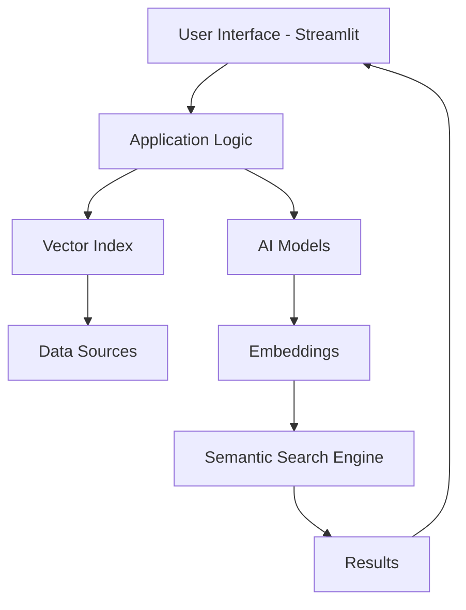

# OGM.Insy - AI-Powered Semantic Search and Insights Platform

<style>
h1 { color: darkblue; font-size: 2.5em; font-weight: bold; }
h2 { color: blue; font-size: 2em; }
h3 { color: green; font-size: 1.5em; }
h4 { color: purple; font-size: 1.2em; }
</style>

## Project Purpose

OGM.Insy is an advanced AI-powered platform designed to provide semantic search and intelligent insights for data analysis. It leverages vector indexing, machine learning, and natural language processing to enable contextual understanding and retrieval of information from large datasets.

## Features

<details><summary>Core Features</summary>

- **Semantic Search**: Understands intent and context beyond keywords
- **Vector Indexing**: Efficient similarity search using embeddings
- **AI-Powered Insights**: Machine learning models for data analysis
- **Streamlit Interface**: User-friendly web interface for interactions
- **Jupyter Integration**: Notebook support for data exploration

</details>

## Use Cases

<details><summary>Key Use Cases</summary>

- **Enterprise Search**: Enable semantic search across large corporate datasets for quick information retrieval
- **Healthcare Data Analysis**: Provide contextual insights from medical records and research data
- **Business Intelligence**: Generate AI-powered insights from business data for decision making
- **Research and Development**: Assist in semantic querying of scientific literature and patents
- **Customer Support**: Enhance chatbot capabilities with contextual understanding

</details>

## Technology Stack

<details><summary>Technologies Used</summary>

- **Programming Language**: Python 3.12
- **Frameworks**: Streamlit, Jupyter Lab
- **AI/ML**: Vector databases, embeddings, semantic search algorithms
- **Deployment**: Docker, Helm, Kubernetes
- **Version Control**: Git, Azure DevOps, GitHub

</details>

## Architecture

<details><summary>System Architecture</summary>



</details>

## Project Structure

```
ogm.github.insy/
├── .git/
├── .gitignore
├── .venv/
├── READ_OGM.Insy.md
├── appmap.log
└── src/
    ├── __init__.py
    └── app/
        ├── .streamlit/
        ├── __init__.py
        ├── appmap.log
        ├── ogm_insy_v1.py
        ├── requirements.txt
        └── steps/
            ├── __init__.py
            ├── __pycache__/
            ├── step0_environment/
            ├── step0_streamlit/
            ├── step0_utility/
            ├── step10_response_agent/
            ├── step11_moderation/
            ├── step12_monitor/
            ├── step13_evaluation/
            ├── step14_app_deployment/
            ├── step15_app_run/
            ├── step16_app_automation/
            ├── step17_app_scaling/
            ├── step1_data_loading/
            ├── step2_data_chunking/
            ├── step3_embeding/
            ├── step4_vector_database/
            ├── step5_knowledge_graph/
            ├── step6_prompt_eng/
            ├── step7_llm_model/
            ├── step8_memory/
            └── step9_retrieval/
```

## Installation Instructions

<details><summary>Local Installation</summary>

1. Create virtual environment:
   ```bash
   python3.12 -m venv .venv_p312
   source .venv_p312/bin/activate
   ```

2. Install dependencies:
   ```bash
   pip install streamlit jupyter lab
   ```

3. Run the application:
   ```bash
   cd src/app
   streamlit run mainVectorIndex.py
   ```

</details>

## Docker Images

<details><summary>Docker Setup</summary>

Build the Docker image:
```bash
docker build -t ogm-insy:latest .
```

Run the container:
```bash
docker run -p 8501:8501 ogm-insy:latest
```

</details>

## Helm Charts

<details><summary>Kubernetes Deployment</summary>

Deploy using Helm:
```bash
helm install ogm-insy ./helm-charts/ogm-insy
```

</details>

## Deployment Instructions

<details><summary>Production Deployment</summary>

1. Build and push Docker image
2. Deploy to Kubernetes cluster using Helm
3. Configure ingress and services
4. Set up monitoring and logging

</details>

## Git Operations

<details><summary>Git and Remote Management</summary>

# Check Current Remotes:
git remote -v

# Add GitHub as a Remote
git remote add github https://github.com/mksaraf/ogm.insy2.git

# Push to Both Remotes:
git push origin main
git push github main

# Pull
git pull github main

# Remove github remote
git remote remove github

</details>

## Lessons Learned

<details><summary>Semantic Search Insights</summary>

Semantic search aims to understand search phrases' intent and contextual meaning, rather than focusing on individual keywords.

Traditional keyword search often depends on exact-match keywords or proximity-based algorithms that find similar words.

## Numerous strategies for understanding context

</details>
    - Other information: What other information is included in the search? For example, if the search phrase contains bank and river, the search is likely about waterways, not financial institutions.
    - User information: What is known about the user? Their search history and location can provide information about the context of the search. If they are in the UK, a search for "football" is likely about soccer, not American football.
    - Scenario: What scenario is being presented to the user? If the search is on a website about cars, a search for dash is likely about dashboards, not running quickly.

## Semantic Search
The results of a semantic search are typically scored based on
    - The relevance of the result to the search
    - The popularity of the result
    - The quality of the result

## Challenges with Semantic Search
    - Understanding Context - Accurately grasping the context of queries can be difficult. Different users might use the same words to mean different things.
    - Language Ambiguity - Natural language is inherently ambiguous. Words can have multiple meanings, and different models may interpret sentences differently.
    - Fine tuning - To get the best result, you may need to invest significant effort in fine-tuning your model, data and search algorithms.
    - Transparency - The complexity behind semantic search can make understanding how a score is determined or why a particular result is returned difficult.

# Vector
Vectors are simply a list of numbers. For example, the vector [1, 2, 3] is a list of three numbers and could represent a point in three-dimensional space. You can use vectors to represent many different types of data, including text, images, and audio.

## Dimensionality 
The number of dimensions in a vector is called the dimensionality of the vector. For example, a vector with three numbers has a dimensionality of 3. A vector containing 100 numbers has a dimensionality of 100.

## Embedding
Converting words/doc into numbers.
Embeddings can represent more than just words. They can also represent entire documents, images, audio, or other data types.

## Embedding Models
- OpenAI’s text-embedding-ada-002. 1,536 dimensions.
    - Word2Vec - A model for generating word embeddings, turning words into vectors based on their context.
    - FastText - An extension of Word2Vec, FastText treats each word as composed of character n-grams, allowing it to generate embeddings for out-of-vocabulary words.
    - Node2Vec - An algorithm that computes embeddings based on random walks through a graph.
    - GPT (Generative Pre-trained Transformer) - A series of models (e.g. GPT-4) that use transformers for generating text that you can also use for generating embeddings.
    - Universal Sentence Encoder - Designed to convert sentences into embeddings.
    - Doc2Vec - An extension of the Word2Vec model to generate embeddings for entire documents or paragraphs, capturing the overall meaning.
    - ResNet (Residual Networks) - Primarily used in image processing, ResNet models can also be used to generate embeddings for images that capture visual features and patterns.
    - VGGNet - VGGNet models are used in image processing to generate embeddings for images, capturing various levels of visual information.
- Each embedding model is different and captures different aspects of the data. As such, you cannot compare embeddings created by different models. You need to use the same model to generate the embeddings for the data you want to compare.